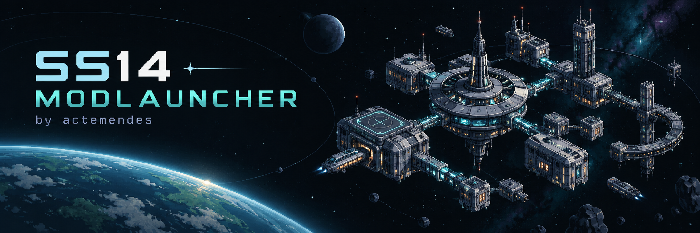

# SS14 ModLauncher

**Your client. Your mod loadout.** By **actemendes**.

[Русский](README.ru.md) · [User guide](docs/user-guide.md) · [Development](docs/development.md) · [Release checklist](docs/releasing.md)

[**Download for Windows x64**](https://github.com/actemendes/ss14-modlauncher/releases/latest) · [Report a bug](https://github.com/actemendes/ss14-modlauncher/issues/new/choose)

A Windows mod launcher for Space Station 14: choose a mod profile, launch the original SS14 launcher, and restore a clean installation from the same app. The dark interface takes its visual cues from **ss14-crew-monitor**.

**Independent community project.** This is not an official Space Wizards Federation launcher and is not affiliated with the SS14 developers. Version **0.1.1** targets **Windows x64**.


[View the Russian interface](docs/assets/launcher-ru.png)

## What you can do

| Feature | In this release |
| --- | --- |
| Mod library | Choose the bundled Crew Console and Hello World mods |
| Profiles | Save different selections and switch before starting the client |
| RU / EN | Localized launcher and bundled mod labels |
| Installer and patcher | Back up the original loader and verify file hashes before changing it |
| Steam integration | Optionally open ModLauncher from the normal Steam Play action |
| Restore clean SS14 | Restore the loader and optional Steam entry point using verified backups |
| Mod updates | Manually check a configured GitHub repository; verify downloaded DLLs against its manifest |
| Diagnostics | Inspect installation state, save a local report, or launch once without mods |
| Local operation | Use bundled mods without an account or an update service |

The default update source is [`actemendes/ss14-modlauncher`](https://github.com/actemendes/ss14-modlauncher). Checks run only when requested. ModLauncher does not silently update itself or install arbitrary ZIP packages.

## Get started

1. Extract the complete `SS14ModLauncher-0.1.1-win-x64.zip` package to a writable folder. No separate .NET installation is required.
2. Close the SS14 client and its original launcher, then run **SS14ModLauncher.exe**.
3. Select the folder containing `SS14.Launcher.exe` and `loader/SS14.Loader.dll`. A Steam installation usually uses `Space Station 14 Playtest/bin_x64`.
4. Choose a profile and mods, then install/apply the selection.
5. Launch SS14 from ModLauncher. Connect to your server using the original SS14 launcher.

Optional Steam integration replaces the launcher entry point with a reversible bridge. Steam Play then opens ModLauncher, which starts the original launcher when you are ready. See the [user guide](docs/user-guide.md) before enabling it.

To remove the integration, close the client and original launcher and use **Restore originals**. Do not delete the backups manually. A Steam update or file verification can overwrite patched files; the app checks the installation instead of blindly overwriting unexpected changes.

## Included mods

### Crew Console

An enhanced native crew monitoring console: searchable crew list, health states, damage history, a draggable timeline, and the selected crewmember's route on the station map. Open an ordinary in-game crew monitoring console to use it.

History exists only while that console window is open. The mod uses telemetry already provided to the normal console and does not invent missing positions or health. Rooms, zones, message history, recording files, and full replay from the web Crew Monitor are not included. See [features and limits](docs/mods/crew-console.md).

### Hello World

A small example mod with a movable, resizable window. Press **F1**, **0**, or **NumPad 0** to toggle it. These keys replace their normal actions while the mod is enabled; text-field focus and Ctrl/Alt/Shift combinations are left alone.

## Compatibility and trust

The bundled mods were exercised in a local game with **SS14 Launcher 0.40.2** and **Robust 275.0.0**. See the [verification record](docs/verification.md). Other launcher versions, server forks, and future client updates require separate verification. This first release does not promise compatibility with every server.

Mods run as local DLLs with the game's process permissions. Use trusted code and follow the rules of the server you join. SHA-256 checks detect download corruption or a mismatch with the selected manifest; they do not establish that a publisher is trustworthy. Engine signature checks and normal SS14 authentication are not disabled.

## Build from source

Install **.NET SDK 10** and **PowerShell 7** on Windows, then run:

```powershell
git clone https://github.com/actemendes/ss14-modlauncher.git
cd ss14-modlauncher
./build.ps1
```

The script runs the test harnesses, builds the bundled mods, and creates the self-contained app, release ZIP, and checksums in `dist/`. This only builds local artifacts; it does not create a GitHub release or publish anything.

Read [development](docs/development.md), [architecture](docs/architecture.md), and [mod update format](docs/updates.md) for details. Future independent mod repositories can be pinned as Git submodules; no placeholder submodule URLs are configured.

## Project documentation

- [User guide and recovery](docs/user-guide.md)
- [Architecture and file layout](docs/architecture.md)
- [Development and mod contract](docs/development.md)
- [Update manifests](docs/updates.md)
- [Preparing a release](docs/releasing.md)
- [Changelog](CHANGELOG.md), [contributing](CONTRIBUTING.md), [security](SECURITY.md)
- [Third-party notices](THIRD-PARTY-NOTICES.md) and [MIT license](LICENSE)

Licensed under **MIT**. Third-party components retain their own licenses. See the [verification record](docs/verification.md) for completed checks and remaining live compatibility checks.
