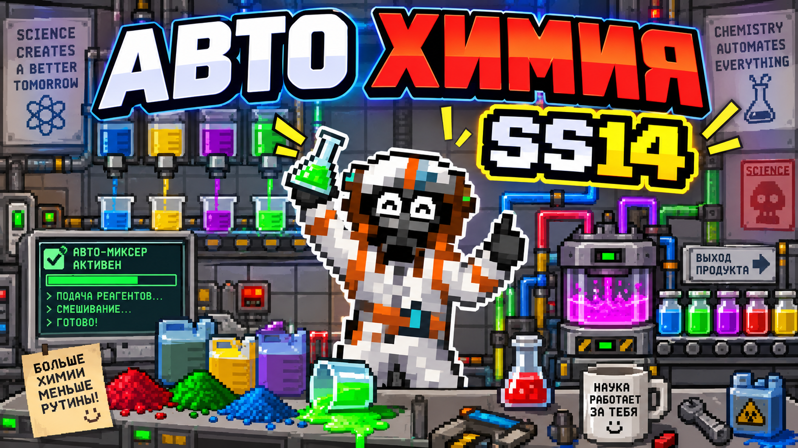
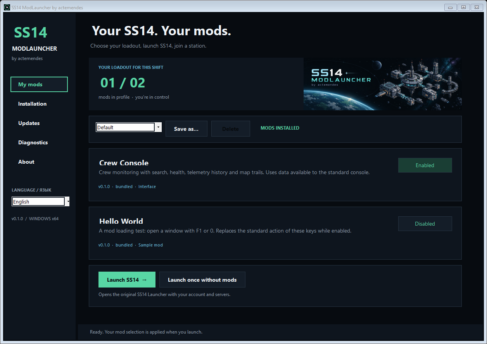

# SS14 ModLauncher

**Your client. Your mod loadout.** By **actemendes**.

[Русский](README.ru.md) · [User guide](docs/user-guide.md) · [Development](docs/development.md) · [Release checklist](docs/releasing.md)

[**Download for Windows x64**](https://github.com/actemendes/ss14-modlauncher/releases/download/v0.1.7/SS14ModLauncher-0.1.7-win-x64.zip) · [Report a bug](https://github.com/actemendes/ss14-modlauncher/issues/new/choose)

A Windows mod launcher for Space Station 14: choose a mod profile, launch the original SS14 launcher, and restore a clean installation from the same app. The dark interface takes its visual cues from **ss14-crew-monitor**.

**Independent community project.** This is not an official Space Wizards Federation launcher and is not affiliated with the SS14 developers. Version **0.1.7** targets **Windows x64**.

[](https://youtu.be/hZwgM-wkamc)

**Auto Chemistry 0.1.4** — server recipes, automatic production plans and saved presets inside the native ChemMaster. [How to use it](docs/mods/chemmaster.md) · [**Watch the demo on YouTube**](https://youtu.be/hZwgM-wkamc).



[View the Russian interface](docs/assets/launcher-ru.png)

## What you can do

| Feature | In this release |
| --- | --- |
| First-run setup | Find SS14 automatically and set up the recommended Crew Monitor profile with one action |
| Mod library | Search and choose Crew Monitor, Conversations, Distress Call, Auto Chemistry and Test Mod |
| Profiles | Save different selections and switch before starting the client |
| RU / EN | Localized launcher and bundled mod labels |
| Installer and patcher | Back up the original loader and verify file hashes before changing it |
| Steam integration | Steam Play opens ModLauncher by default after installation; you can opt out |
| Restore clean SS14 | Restore the loader and Steam entry point using verified backups |
| Update notifications | Check once at startup; show launcher and mod updates separately |
| Independent mod updates | Apply compatible DLL updates with SHA-256 verification; see which need a newer launcher |
| Diagnostics | Inspect installation state, save a local report, or launch once without mods |
| Local operation | Use bundled mods without an account or an update service |

The default update source is [`actemendes/ss14-modlauncher`](https://github.com/actemendes/ss14-modlauncher). ModLauncher checks once in the background when opened; disable **Check for updates at startup** in Updates if preferred. Manual checks remain available. Nothing downloads or installs automatically, and checks do not run while the app is closed. An unavailable network does not block launch.

## Get started

1. Extract the complete `SS14ModLauncher-0.1.7-win-x64.zip` package to a writable folder. No separate .NET installation is required.
2. Run **SS14ModLauncher.exe**. The first-run window looks for SS14 and offers the recommended default profile with **Crew Monitor** enabled.
3. Press **Set up & play**. ModLauncher installs the selected mods, adds Steam integration for a recognized Steam installation, and opens the original SS14 launcher for your normal server connection.

If the game was not found, choose its folder; ModLauncher also accepts the game folder above `bin_x64`. If the game or original launcher is running, close it and retry. Cancelling setup installs nothing and dismisses the automatic prompt for that installation. Return anytime through **Installation → Quick setup**. Existing installations skip the automatic popup. After setup, Steam Play opens ModLauncher, where profiles and individual mods remain editable.

Steam integration is enabled by default when a matching Steam app manifest and library layout identify the installation. The mod patch and reversible launch bridge are installed together. Standalone installations keep their original entry point. Use **Disable integration** to opt out: that choice survives mod updates and reinstalls. Restoring clean SS14 removes the bridge immediately and preserves your preference for a later reinstall. See the [user guide](docs/user-guide.md).

To remove the integration, close the client and original launcher and use **Restore originals**. Do not delete the backups manually. A Steam update or file verification can overwrite patched files; the app checks the installation instead of blindly overwriting unexpected changes.

## Included mods

In **0.1.7**, the compact library puts search, versions, categories and toggles in short rows. **Details** opens descriptions and usage instructions; **Auto Chemistry** includes an AUTO tab screenshot. Display names changed; profiles and saved settings are preserved.

Feed **0.1.7** updates **Auto Chemistry** to **0.1.4**: native AUTO and AUTO settings tabs
with server-specific reaction rules, a plan that rebuilds itself after every change, saved production targets and automated
mixing with confirmed transfers, adjustable speed, reagent-switch pauses and random intervals. Open a ChemMaster with an empty input beaker and
base reagents in its buffer. [Usage and limitations](docs/mods/chemmaster.md).

**0.1.6** includes **Distress Call 0.1.2**: a localized
radio distress call at awful health, once per episode with a 30-second cooldown.
Recent explicit damage origins can name the attacker in a single in-game sentence.
English launcher UI selects English replies: "Help, I'm dying!" and "Help, … is killing me!".
[Setup and attribution limits](docs/mods/death-rattle.md).

**0.1.6** includes **Conversations 0.1.1**: native chat receive
timestamps, speaker name and message-text search, multiple selected voices and department filtering by
radio channel. Open the panel with the Conversations button above chat history.
[Usage and limitations](docs/mods/conversations.md).

Launcher **0.1.7** includes Crew Monitor **0.1.2** and Test Mod **0.1.2**, preserving their published DLL bytes. Launcher and mod versions evolve independently.

### Crew Monitor

An enhanced native crew monitoring console: searchable crew list, health states, damage history, a draggable timeline, and the selected crewmember's route on the station map. Open an ordinary in-game crew monitoring console to use it.

History exists only while that console window is open. The mod uses telemetry already provided to the normal console and does not invent missing positions or health. Rooms, zones, message history, recording files, and full replay from the web Crew Monitor are not included. See [features and limits](docs/mods/crew-console.md).

### Test Mod

A small example mod with a movable, resizable window. Press **F1**, **0**, or **NumPad 0** to toggle it. These keys replace their normal actions while the mod is enabled; text-field focus and Ctrl/Alt/Shift combinations are left alone.

## Compatibility and trust

The **0.1.0** bundled mods were exercised in a local game with **SS14 Launcher 0.40.2** and **Robust 275.0.0**. See the [verification record](docs/verification.md). Other launcher versions, server forks, and future client updates require separate verification. Compatibility with every server is not guaranteed.

Mods run as local DLLs with the game's process permissions. Use trusted code and follow the rules of the server you join. SHA-256 checks detect download corruption or a mismatch with the selected manifest; they do not establish that a publisher is trustworthy. Engine signature checks and normal SS14 authentication are not disabled.

## Build from source

Install **.NET SDK 10** and **PowerShell 7** on Windows, then run:

```powershell
git clone https://github.com/actemendes/ss14-modlauncher.git
cd ss14-modlauncher
./build.ps1
```

The script runs the test harnesses, builds the launcher, reuses hash-locked published mod DLLs (or builds newly versioned mods), and creates the self-contained app, release ZIP, and checksums in `dist/`. This only builds local artifacts; it does not create a GitHub release or publish anything.

Read [development](docs/development.md), [architecture](docs/architecture.md), and [mod update format](docs/updates.md) for details. Future independent mod repositories can be pinned as Git submodules; no placeholder submodule URLs are configured.

## Project documentation

- [User guide and recovery](docs/user-guide.md)
- [Architecture and file layout](docs/architecture.md)
- [Development and mod contract](docs/development.md)
- [Update manifests](docs/updates.md)
- [Preparing a release](docs/releasing.md)
- [Changelog](CHANGELOG.md), [contributing](CONTRIBUTING.md), [security](SECURITY.md)
- [Third-party notices](THIRD-PARTY-NOTICES.md) and [MIT license](LICENSE)

Licensed under **MIT**. Third-party components retain their own licenses. See the [verification record](docs/verification.md) for completed checks and remaining live compatibility checks.
