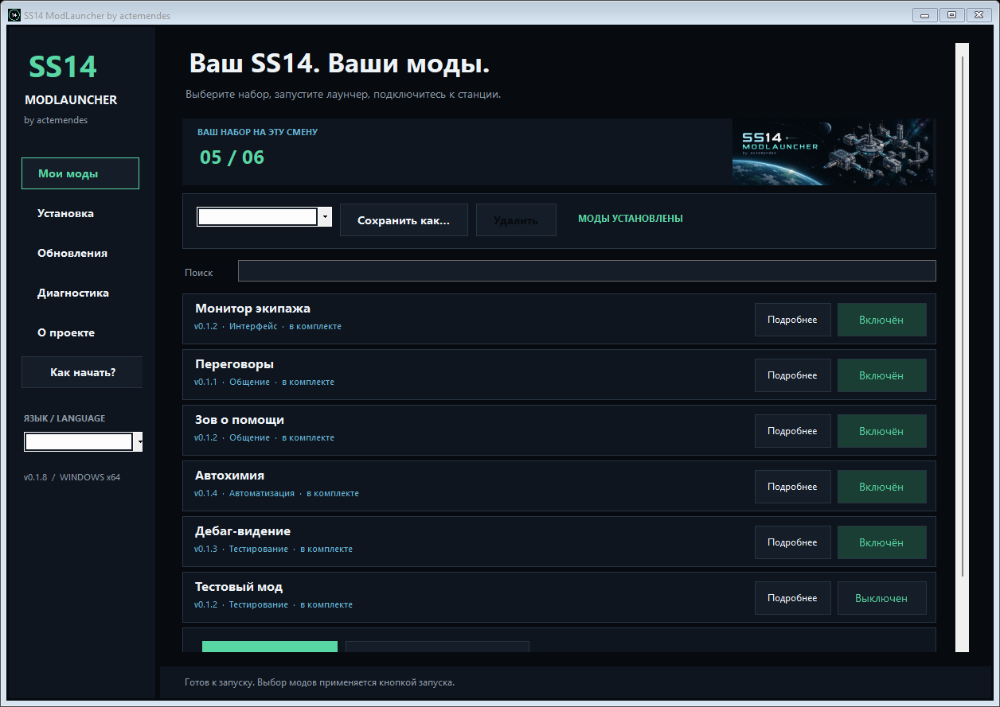

# SS14 ModLauncher

**Твой клиент. Твой набор модов.** Автор — **actemendes**.

[English](README.md) · [Руководство](docs/user-guide.md) · [Разработка](docs/development.md) · [Подготовка релиза](docs/releasing.md)

[**Скачать для Windows x64**](https://github.com/actemendes/ss14-modlauncher/releases/latest) · [Сообщить об ошибке](https://github.com/actemendes/ss14-modlauncher/issues/new/choose)

Мод-лаунчер Space Station 14 для Windows: выбор модов и профилей, запуск штатного SS14 Launcher и восстановление чистой установки из одного приложения. Тёмный интерфейс вдохновлён **ss14-crew-monitor**.

**Независимый проект сообщества.** Это не официальный лаунчер Space Wizards Federation; проект не связан с разработчиками SS14. Версия **0.1.2**, платформа — **Windows x64**.



[Интерфейс на английском](docs/assets/launcher-en.png)

## Возможности

| Функция | В этой версии |
| --- | --- |
| Библиотека модов | Включение и отключение Crew Console и Hello World |
| Профили | Сохранение разных наборов модов и выбор перед запуском |
| Русский и English | Локализация лаунчера и подписей комплектных модов |
| Установщик-патчер | Резервная копия оригинального загрузчика, проверка SHA-256 перед изменением файлов |
| Интеграция Steam | После установки кнопка «Играть» открывает ModLauncher по умолчанию; можно отключить |
| Чистый SS14 | Восстановление загрузчика и точки запуска Steam по проверенным копиям |
| Обновления модов | Ручная проверка указанного GitHub-репозитория и сверка скачанных DLL с манифестом |
| Диагностика | Состояние установки, локальный отчёт и один запуск без модов |
| Локальная работа | Комплектные моды работают без аккаунта и сервиса обновлений |

Источник обновлений по умолчанию — [`actemendes/ss14-modlauncher`](https://github.com/actemendes/ss14-modlauncher). Проверка запускается только по вашей команде. Скрытого самообновления лаунчера и установки произвольных ZIP-пакетов нет.

## Быстрый старт

1. Распакуйте весь `SS14ModLauncher-0.1.2-win-x64.zip` в доступную для записи папку. Устанавливать .NET отдельно не требуется.
2. Закройте игровой клиент и штатный лаунчер SS14. Запустите **SS14ModLauncher.exe**.
3. Выберите папку с `SS14.Launcher.exe` и `loader/SS14.Loader.dll`. Для Steam это обычно `Space Station 14 Playtest/bin_x64`.
4. Выберите профиль и моды, затем установите их или запустите игру с выбранным набором. Для распознанной установки Steam интеграция запуска добавится автоматически.
5. Запустите SS14 через Steam или ModLauncher. Кнопка «Играть» открывает ModLauncher, а его кнопка запуска — штатный лаунчер для обычного подключения к серверу.

Интеграция Steam включается по умолчанию, если установка распознана по соответствующему манифесту приложения и структуре библиотеки Steam. Патч модов и обратимый мост запуска устанавливаются вместе. У отдельной установки вне Steam точка запуска по умолчанию не меняется. Кнопка **Отключить интеграцию** сохраняет ваш выбор при обновлениях модов и повторной установке. Восстановление чистого SS14 сразу убирает мост и сохраняет предпочтение для будущей переустановки. Подробности — в [руководстве](docs/user-guide.md).

Для удаления закройте игру и штатный лаунчер, затем выберите **Восстановить оригинал**. Не удаляйте резервные копии вручную. Steam может перезаписать модификацию при обновлении или проверке файлов; приложение проверяет состояние и не затирает неизвестные изменения вслепую.

## Моды в комплекте

### Crew Console

Расширенная штатная консоль мониторинга экипажа: поиск, состояния здоровья, история урона, временная шкала с перетаскиванием курсора и маршрут выбранного персонажа на карте станции. Для использования откройте обычную игровую консоль мониторинга.

История записывается только при открытом окне и очищается после его закрытия. Используются данные обычной подписки консоли; отсутствующие координаты и показатели не угадываются. Комнаты, зоны, сообщения, файлы записей и полный replay веб-панели пока не перенесены. [Подробные возможности и ограничения](docs/mods/crew-console.md).

### Hello World

Небольшой пример мода: перемещаемое окно с изменяемым размером по **F1**, **0** или **NumPad 0**. Пока мод включён, эти клавиши заменяют штатные действия. В текстовых полях и сочетаниях с Ctrl/Alt/Shift перехвата нет.

## Совместимость и доверие

Встроенные моды версии **0.1.0** проверены в локальной игре с **SS14 Launcher 0.40.2** и **Robust 275.0.0**. Подробности — в [отчёте о проверках](docs/verification.md). Совместимость с другими версиями, серверными форками и будущими обновлениями требует отдельной проверки. Совместимость со всеми серверами не гарантируется.

DLL модов выполняются с правами игрового процесса. Используйте доверенный код и соблюдайте правила выбранного сервера. SHA-256 выявляет повреждение или несоответствие файлу из манифеста, но не доказывает надёжность автора. Проверка подписи движка и обычная авторизация SS14 не отключаются.

## Сборка

Нужны **.NET SDK 10** и **PowerShell 7** для Windows:

```powershell
git clone https://github.com/actemendes/ss14-modlauncher.git
cd ss14-modlauncher
./build.ps1
```

Скрипт запускает тесты, собирает моды и создаёт автономный лаунчер, ZIP и контрольные суммы в `dist/`. Это только локальная сборка: релиз в GitHub не создаётся и ничего не публикуется.

Документация: [разработка](docs/development.md), [архитектура](docs/architecture.md), [формат обновлений](docs/updates.md), [релиз](docs/releasing.md), [история изменений](CHANGELOG.md), [вклад в проект](CONTRIBUTING.md), [безопасность](SECURITY.md).

Будущие отдельные репозитории модов можно подключить Git submodules с фиксированными commit SHA. Фиктивные адреса модулей не добавлены.

Лицензия проекта — **[MIT](LICENSE)**. Зависимости сохраняют [свои лицензии](THIRD-PARTY-NOTICES.md). Выполненные проверки и оставшиеся проверки в живой игре описаны в [отчёте](docs/verification.md).
