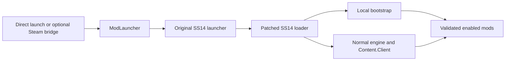

# Architecture

## Responsibilities

| Component | Purpose |
| --- | --- |
| `Installer/` | Windows desktop app, RU/EN UI, orchestration, embedded payload |
| `Launcher.Core/` | Installation inspection, patch/restore transactions, Steam bridge management, profiles/catalog, update validation |
| `Bootstrap/` | Runtime entry point, selection/hash checks, isolated per-mod failure logging |
| `CrewConsole/` | Native monitoring UI, sensor history and routes |
| `HelloWorld/` | Small Harmony-based example mod |
| `tests/` | Crew history, map/layout, and timeline regression harness |
| `Launcher.Core.Tests/` | Core regression harness with temporary fixtures |
| `docs/` | User guide, contracts, recovery and release information |

The directory name `Installer` is retained for source continuity; its published app is `SS14ModLauncher.exe`.

## Launch sequence



A small call is added to `SS14.Loader.dll`. Normal authentication and engine verification remain in the original code. The bootstrap registers local dependency resolution and installs enabled mods when `Content.Client` is available. It does not change downloaded server content.

## Installation files

Paths below are relative to the selected SS14 launcher directory:

```text
SS14.Launcher.exe                    original apphost, or optional Steam bridge
SS14.Launcher.clean.exe              original apphost backup for Steam integration
SS14ModLauncher/
  SS14ModLauncher.exe               stable installed mod launcher
  steam.json                        active Steam integration hashes/state
  launcher.json                     retained stable launcher ownership
loader/
  SS14.Loader.dll                   original or patched loader
  SS14LocalMods/
    installation.json               original/patched hashes and installation state
    SS14.Loader.original.dll        original loader backup
    selection.json                  versioned language + enabled DLL/hash list
    ownership.json                  retained payload ownership for safe reinstall
    SS14LocalMods.Bootstrap.dll
    0Harmony.dll
    Mods/
      CrewConsole.Mod.dll
      HelloWorld.Mod.dll
```

The original launcher apphost is kept in its original directory so it can resolve its existing launcher DLL/runtime files. No Steam library configuration is rewritten.

Per-user settings live in `%LOCALAPPDATA%/SS14ModLauncher/settings.json`. Runtime mod logs remain in `%LOCALAPPDATA%/SS14LocalMods/mods.log`.

## Integrity and failure behaviour

Installation state records SHA-256 values. Existing and backup files are checked before changing or restoring them. Unknown changes produce an error rather than being overwritten. The core uses a transaction journal and rollback for installation mutations; restoration checks the loader and optional Steam integration together.

Selection is explicit. Missing or corrupt selection data does not enable arbitrary DLLs. Bootstrap loads only selected, hash-matching filenames, and catches individual mod failures. This is integrity checking, not a security sandbox.

After Steam has verified a new upstream build, explicit `RebaseAfterPlatformUpdate` archives the previous backups and state in `loader/SS14LocalMods/History/<id>/` and adopts the new compatible originals as the baseline. It rejects an active patch/bridge. This requires a deliberate user confirmation; structural checks are not publisher authentication.

Mod update manifests are obtained only from the configured GitHub release source. Downloads are checked before replacement. See [updates](updates.md) for the schema and publisher trust boundary.

## Supported scope

Windows x64, a compatible existing SS14 installation, and the bundled catalog. Linux/macOS, workshop distribution, arbitrary plugin dependency solving, and launcher self-update are outside version 0.1.0. Profile changes take effect on a newly launched game client.

The [Crew Console reference](mods/crew-console.md) describes telemetry limits. The older [port research](crew-monitor-port.md) is preserved as historical design context.
