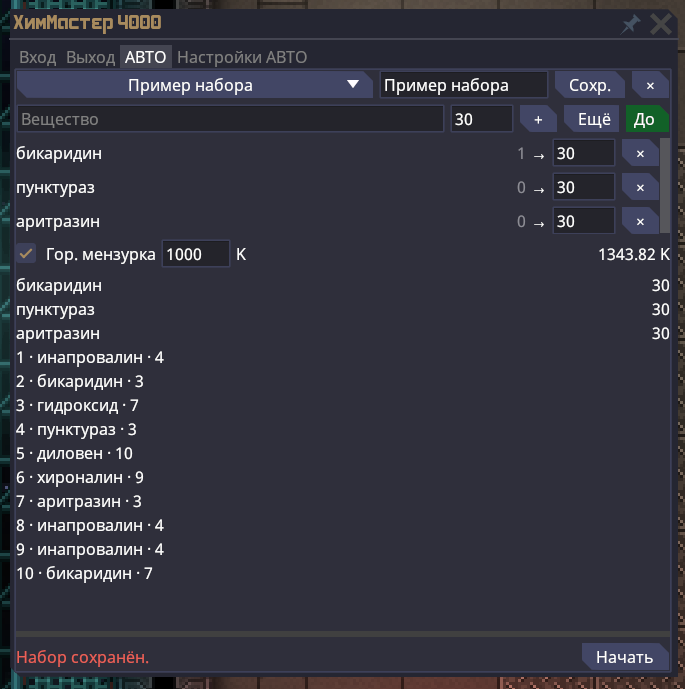

# Автохимия / Auto Chemistry — 0.1.4

Display name in ModLauncher: **Автохимия** (RU), **Auto Chemistry** (EN). The stable ID `chem-master`, assembly `ChemMaster.Mod.dll`, settings paths and the native in-game ChemMaster name are unchanged.

[**Демонстрация Автохимии / Watch the Auto Chemistry demo**](https://youtu.be/hZwgM-wkamc)

Мод добавляет вкладки **АВТО / AUTO** и **Настройки АВТО / AUTO settings** в обычный игровой химмастер. Требуется ModLauncher 0.1.6. Язык мода следует RU/EN языку лаунчера; названия веществ берутся из локализации игрового клиента.

## Использование

1. Включите «Автохимию» в профиле ModLauncher и запустите клиент заново.
2. Загрузите исходные вещества в буфер химмастера, вставьте пустую входную мензурку.
3. Откройте АВТО, введите название или prototype ID в поле «Вещество», задайте объём и нажмите Enter либо выберите строку из списка под полем.
4. «Ещё / More» прибавляет объём к текущему запасу; «До / Up to» доводит запас до объёма. Объём цели правится прямо в строке; серое число — запас в буфере.
5. План строится сам после каждой правки и при изменении состава аппарата. Проверьте выход (избыток целой партии показан жёлтым) и партии.
6. Нажмите «Начать / Start». Результат возвращается в буфер. Во время варки цели заблокированы; доступны «Пауза / Pause» и «Стоп / Stop».
7. После «Стоп» или сбоя «Пересчитать / Replan» строит план до прежнего целевого запаса от текущего состава. После завершения «Повтор / Again» строит новый план по тем же целям.

Нижняя строка показывает одно состояние: число шагов и оценку времени, прогресс, требуемую мензурку или причину ошибки. Полный текст — во всплывающей подсказке.

Наборы: выбор в списке сразу загружает набор; «Сохр. / Save» записывает название, режим и цели, «×» удаляет выбранный набор. Ингредиенты и порядок смешивания пересчитываются по правилам текущего подключения. Файл наборов: `%LOCALAPPDATA%\SS14LocalMods\ChemMaster\recipes.json`.

## Холодная и горячая мензурки

План учитывает температуру каждой промежуточной реакции и конкурирующие реакции этого сервера. Например, при нагреве смесь для масла может дать бензол. В этом случае промежуточный продукт готовится в холодной мензурке, а нагреваемые этапы — в горячей.

Галочка «Гор. мензурка / Hot beaker» разрешает такие смены; рядом задаётся температура подготовленной горячей ёмкости в K. В точке смены исполнитель останавливается с пустой входной ёмкостью и показывает требуемую и текущую температуру. Кнопка «Извлечь / Вставить» использует штатный слот химмастера: извлекает установленную пустую мензурку либо вставляет ёмкость из активной руки. Установите нужную пустую мензурку той же вместимости и нажмите «Продолжить / Resume»: это и есть подтверждение требуемой фазы.

Вкладка показывает фактическую температуру входной мензурки. Если клиент её не знает, появляется выбор «Холодная / Горячая» для установленной ёмкости. До подтверждения команд нет. При доступной температуре клиент пересчитывает оставшийся рецепт по фактическому значению: горячая мензурка могла остыть. При недоступной температуре используется выбранная фаза и заданная температура горячей мензурки. Изменение буфера, аппарата, персонажа, режима или вместимости запрещает продолжение. Фаза хранится отдельно от температуры: слегка нагревшаяся холодная мензурка не становится автоматически горячей.

Температура горячей мензурки сохраняется в `%LOCALAPPDATA%\SS14LocalMods\ChemMaster\beakers.json`. Мод использует заранее подготовленные ёмкости; нагреватель пользователь обслуживает вручную. Температуры выше 10 000 K допускаются, если они конечны: реакции сервера могут сильно нагревать ёмкость. Сам план всё равно проверяет температурные окна реакций.

## Настройки АВТО

| Ползунок / Slider | Диапазон | По умолчанию |
| --- | --- | --- |
| Скорость / Transfer speed | 1–20 команд в секунду для последовательных переносов одного вещества | 8 |
| Пауза при смене вещества / Reagent-switch pause | 0–3 секунды дополнительно | 0.6 с |
| Хаотичность / Chaos | 0–100% вероятности изменения очередного интервала | 40% |

После подтверждения команды сервером исполнитель ждёт базовый интервал `1 / скорость`. С указанной вероятностью этот интервал умножается на случайное число от 0.4 до 1.6, поэтому очередная команда может оказаться ближе или дальше от предыдущей. При смене prototype ID дополнительно прибавляется заданная пауза; хаотичность её не сокращает. Первый перенос начинается сразу после запуска.

Например, скорость 8 даёт базовый интервал 125 мс. При хаотичности 40% он в 40% случаев будет от 50 до 200 мс; при смене вещества дополнительно добавятся 600 мс. Ответ сервера и частота игрового обновления могут увеличить фактическое время. Повторные дозы одного вещества не получают паузу смены вещества.

Настройки действуют во время варки, сохраняются после отпускания ползунка и восстанавливаются при следующем открытии окна. Кнопка «По умолчанию / Defaults» сбрасывает все три параметра. Файл: `%LOCALAPPDATA%\SS14LocalMods\ChemMaster\settings.json`.

## Исполнение и ограничения

- Используются `IPrototypeManager`, `ReactionPrototype` и `ReagentPrototype` текущего клиента подключения. Встроенного каталога SS220 и fallback к чужим рецептам нет.
- Отправляются стандартные игровые BUI сообщения переноса. Не более одной команды ожидает подтверждения; состав должен совпасть с расчётом. Задержки не отменяют эту проверку.
- Закрытие окна, смена аппарата/персонажа, неожиданная смена мензурки, ручная команда, изменение прототипов или ошибка останавливают выполнение. Ожидаемая смена мензурки допускается только на указанной границе фаз. Неподтверждённая команда через 8 секунд завершается ошибкой без повторной отправки. Стоп не отменяет уже отправленный перенос.
- Поддерживаются промежуточные реакции, катализаторы, доступные на сервере дозы и разделение на партии по вместимости. Планировщик проверяет конкурирующие реакции и порядок внесения ингредиентов.
- Мод не управляет нагревателем, внешними миксерами и фасовкой таблеток/бутылок. Побочные эффекты реакций (газ, сообщения, ЭМИ, взрыв, создание предметов) план не блокируют: состав считается по продуктам реакции, а исполнитель после каждой команды сверяет его с фактическим и останавливается при расхождении. При равных условиях выбирается рецепт без эффектов. Реагенты с дополнительными данными не поддерживаются. Недостижимая дозировка или непросчитываемая реакция даёт ошибку предпросмотра.
- Если исходного вещества не хватает, ошибка называет только его: «Не хватает: кислород». Реакции, которым нужен внешний аппарат (центрифуга, электролиз), как источник не рассматриваются и в сообщение не попадают; ошибка альтернативной реакции не скрывает причину отказа обычного рецепта.
- Сохранённый набор — цель производства по существующим реакциям. Новые серверные химические реакции клиентский мод не добавляет.

## Проверки

Базовое приготовление бикаридина подтверждено пользователем в игре на версии 0.1.0. Интерфейс 0.1.4 проверен пользователем на локальном сервере SS220. Версия 0.1.1 добавляет тайминги и полную локализацию статусов/ошибок. Автоматические проверки покрывают интервалы, вероятность, применение скорости во время выполнения, паузу и проверки состава. Конкретные результаты и границы совместимости — в [verification](../verification.md).
